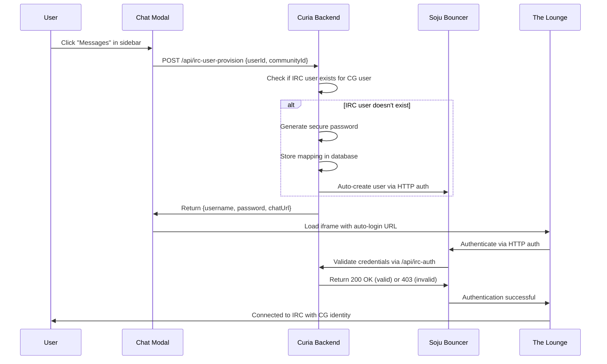

# **Identity Bridge Implementation Plan**

**Goal**: Seamless integration between Curia forum users and IRC chat via automatic user provisioning and authentication.

## **🎯 EXECUTIVE SUMMARY**

### **What We're Building**
A **complete identity bridge** that automatically:
1. **Creates Soju IRC users** for Curia forum users on-demand
2. **Authenticates users seamlessly** when they open the chat modal
3. **Auto-logs into The Lounge** with pre-configured credentials

### **User Experience Flow**
```
User clicks "Messages" in sidebar 
    ↓
Backend creates/verifies Soju user exists
    ↓
Frontend loads chat modal with auto-login URL
    ↓
User is immediately connected to IRC with their identity
```

**No manual setup, no separate passwords, no friction.**

---

## **🏗️ TECHNICAL ARCHITECTURE**

### **Component Overview**
```
Curia Forum (React)
├── Chat Modal (iframe)
│   └── The Lounge (?autologin&user=X&al-password=Y)
├── Backend API
│   ├── /api/irc-user-provision
│   └── /api/irc-auth (for Soju HTTP auth)
└── Database
    └── irc_users table (mapping CG users → IRC credentials)
```

### **Data Flow**


---

## **🔧 IMPLEMENTATION COMPONENTS**

### **1. Database Schema**
```sql
-- New table: IRC user mapping
CREATE TABLE "irc_users" (
    "id" SERIAL PRIMARY KEY,
    "cg_user_id" TEXT NOT NULL REFERENCES users(user_id) ON DELETE CASCADE,
    "irc_username" VARCHAR(255) UNIQUE NOT NULL,
    "irc_password_hash" VARCHAR(255) NOT NULL,
    "irc_realname" TEXT,
    "created_at" TIMESTAMPTZ DEFAULT CURRENT_TIMESTAMP,
    "last_used_at" TIMESTAMPTZ DEFAULT CURRENT_TIMESTAMP
);

CREATE UNIQUE INDEX irc_users_cg_user_id_key ON irc_users(cg_user_id);
CREATE INDEX irc_users_irc_username_key ON irc_users(irc_username);
```

### **2. Backend API Endpoints**

#### **A. User Provisioning Endpoint**
```typescript
// /api/irc-user-provision
export default async function handler(req: NextRequest) {
  const { userId, communityId } = await req.json();
  
  // Check if IRC user already exists
  let ircUser = await findIrcUserByKgUserId(userId);
  
  if (!ircUser) {
    // Generate IRC credentials
    const ircUsername = generateIrcUsername(userId, cgUser.name);
    const ircPassword = generateSecurePassword();
    
    // Store in database
    ircUser = await createIrcUser({
      cgUserId: userId,
      ircUsername,
      ircPasswordHash: await hashPassword(ircPassword),
      ircRealname: cgUser.name || ircUsername
    });
  }
  
  // Generate The Lounge auto-login URL
  const chatUrl = buildChatUrl({
    username: ircUser.ircUsername,
    password: ircUser.plaintextPassword, // Only available during creation
    nick: ircUser.ircUsername,
    realname: ircUser.ircRealname,
    channels: getChannelsForCommunity(communityId)
  });
  
  return Response.json({ 
    success: true, 
    chatUrl,
    username: ircUser.ircUsername 
  });
}
```

#### **B. Soju HTTP Authentication Endpoint**
```typescript
// /api/irc-auth (called by Soju)
export default async function handler(req: NextRequest) {
  const authHeader = req.headers.get('authorization');
  const [username, password] = parseBasicAuth(authHeader);
  
  // Validate against our IRC user database
  const ircUser = await findIrcUserByUsername(username);
  if (!ircUser) {
    return Response.json({ error: 'User not found' }, { status: 403 });
  }
  
  const isValidPassword = await verifyPassword(password, ircUser.ircPasswordHash);
  if (!isValidPassword) {
    return Response.json({ error: 'Invalid password' }, { status: 403 });
  }
  
  // Update last used timestamp
  await updateIrcUserLastUsed(ircUser.id);
  
  return Response.json({ success: true }, { status: 200 });
}
```

### **3. Frontend Integration**

#### **A. Chat Modal URL Generation**
```typescript
// In ChatModal component
const [chatUrl, setChatUrl] = useState<string | null>(null);
const [isProvisioning, setIsProvisioning] = useState(false);

const provisionUser = async () => {
  setIsProvisioning(true);
  
  try {
    const response = await fetch('/api/irc-user-provision', {
      method: 'POST',
      headers: { 'Content-Type': 'application/json' },
      body: JSON.stringify({ 
        userId: user.id, 
        communityId: community.id 
      })
    });
    
    const data = await response.json();
    setChatUrl(data.chatUrl);
  } catch (error) {
    console.error('IRC user provisioning failed:', error);
  } finally {
    setIsProvisioning(false);
  }
};

// Call on modal open
useEffect(() => {
  if (isOpen && !chatUrl) {
    provisionUser();
  }
}, [isOpen]);
```

#### **B. The Lounge URL Construction**
```typescript
function buildChatUrl(params: {
  username: string;
  password: string;
  nick: string;
  realname: string;
  channels: string[];
}) {
  const baseUrl = process.env.NEXT_PUBLIC_CHAT_BASE_URL;
  const url = new URL(baseUrl);
  
  // Auto-login parameters
  url.searchParams.set('autologin', '');
  url.searchParams.set('user', params.username);
  url.searchParams.set('al-password', params.password);
  
  // Auto-connect parameters
  url.searchParams.set('autoconnect', '');
  url.searchParams.set('nick', params.nick);
  url.searchParams.set('username', params.username);
  url.searchParams.set('realname', params.realname);
  
  // Channels to join
  if (params.channels.length > 0) {
    url.searchParams.set('join', params.channels.join(','));
  }
  
  // Iframe-friendly options
  url.searchParams.set('nofocus', ''); // Don't steal focus from parent
  url.searchParams.set('lockchannel', ''); // Don't change active channel
  
  return url.toString();
}
```

### **4. Soju Configuration Update**

```bash
# Add to soju.conf
auth http http://host.docker.internal:3000/api/irc-auth

# Update docker-compose.yml
services:
  curia-irc-soju:
    environment:
      SOJU_AUTH_URL: "http://host.docker.internal:3000/api/irc-auth"
```

---

## **🎨 USER EXPERIENCE DESIGN**

### **Loading States**
```typescript
const ChatModal = () => {
  if (isProvisioning) {
    return (
      <div className="flex items-center justify-center h-64">
        <div className="text-center">
          <Spinner className="mx-auto mb-4" />
          <p>Setting up your IRC account...</p>
          <p className="text-sm text-muted-foreground">
            This only happens once
          </p>
        </div>
      </div>
    );
  }
  
  if (!chatUrl) {
    return (
      <div className="flex items-center justify-center h-64">
        <Button onClick={provisionUser}>
          Connect to Chat
        </Button>
      </div>
    );
  }
  
  return (
    <iframe 
      src={chatUrl}
      className="w-full h-full border-0"
      title="IRC Chat"
    />
  );
};
```

### **Error Handling**
- **Provisioning failures**: Retry button with error message
- **Authentication failures**: Clear invalid credentials, re-provision
- **Network errors**: Graceful fallback to manual setup instructions

---

## **🔐 SECURITY CONSIDERATIONS**

### **Password Security**
- **Generate cryptographically secure passwords** (32+ chars, random)
- **Hash passwords** using bcrypt/scrypt before database storage
- **Never log passwords** in server logs
- **Rotate passwords** periodically or on security events

### **Authentication Flow Security**
- **Validate user sessions** before provisioning IRC accounts
- **Rate limit** provisioning API to prevent abuse
- **Audit log** all IRC user creation and authentication events
- **Secure transmission** - HTTPS only for all API calls

### **URL Parameter Security**
```typescript
// Security considerations for URL parameters
const buildSecureChatUrl = (params) => {
  // Option 1: Use secure tokens instead of passwords
  const sessionToken = generateSessionToken(params.username);
  url.searchParams.set('al-token', sessionToken); // Custom auth
  
  // Option 2: Time-limited URLs
  const expires = Date.now() + (30 * 60 * 1000); // 30 minutes
  url.searchParams.set('expires', expires.toString());
  
  // Option 3: Origin validation
  url.searchParams.set('origin', allowedOrigin);
  
  return url.toString();
};
```

---

## **📊 IMPLEMENTATION PHASES**

### **Phase 1: Core Infrastructure** (2-3 days)
**Goal**: Basic user provisioning and authentication working

**Tasks**:
1. ✅ **Database schema** - Create `irc_users` table
2. ✅ **Backend APIs** - `/api/irc-user-provision` + `/api/irc-auth`
3. ✅ **Soju configuration** - Enable HTTP auth
4. ✅ **Basic testing** - Manual user creation and auth

**Success Criteria**:
- [ ] Soju authenticates users via Curia API
- [ ] New IRC users can be created programmatically
- [ ] Database properly stores IRC user mappings

### **Phase 2: Frontend Integration** (1-2 days)
**Goal**: Chat modal automatically provisions and connects users

**Tasks**:
1. ✅ **Chat modal updates** - Add user provisioning logic
2. ✅ **URL generation** - Build The Lounge auto-login URLs
3. ✅ **Loading states** - User-friendly provisioning experience
4. ✅ **Error handling** - Graceful failure modes

**Success Criteria**:
- [ ] Modal shows loading state during provisioning
- [ ] Users are automatically logged into IRC
- [ ] Error states are handled gracefully

### **Phase 3: Production Hardening** (1-2 days)
**Goal**: Security, performance, and reliability

**Tasks**:
1. ✅ **Security audit** - Password handling, rate limiting, validation
2. ✅ **Performance optimization** - Database indexing, caching
3. ✅ **Monitoring** - Logging, error tracking, metrics
4. ✅ **Documentation** - API docs, troubleshooting guides

**Success Criteria**:
- [ ] No security vulnerabilities in authentication flow
- [ ] Performance acceptable under load
- [ ] Proper monitoring and alerting in place

### **Phase 4: Advanced Features** (2-3 days, optional)
**Goal**: Enhanced user experience and channel management

**Tasks**:
1. ✅ **Dynamic channel management** - Community-specific channels
2. ✅ **User preference sync** - Nickname, realname from CG profile
3. ✅ **Session management** - Handle password resets, account updates
4. ✅ **Multi-community support** - Different channels per community

---

## **🧪 TESTING STRATEGY**

### **Unit Tests**
```typescript
// Test password generation and hashing
describe('IRC User Security', () => {
  test('generates secure passwords', () => {
    const password = generateSecurePassword();
    expect(password).toHaveLength(32);
    expect(password).toMatch(/[A-Za-z0-9!@#$%^&*]/);
  });
  
  test('hashes passwords correctly', async () => {
    const password = 'test-password';
    const hash = await hashPassword(password);
    expect(await verifyPassword(password, hash)).toBe(true);
    expect(await verifyPassword('wrong', hash)).toBe(false);
  });
});

// Test URL generation
describe('Chat URL Generation', () => {
  test('builds correct auto-login URL', () => {
    const url = buildChatUrl({
      username: 'testuser',
      password: 'testpass',
      nick: 'TestNick',
      realname: 'Test User',
      channels: ['#general', '#test']
    });
    
    expect(url).toContain('autologin');
    expect(url).toContain('user=testuser');
    expect(url).toContain('al-password=testpass');
    expect(url).toContain('join=%23general,%23test');
  });
});
```

### **Integration Tests**
```typescript
// Test end-to-end provisioning flow
describe('IRC User Provisioning', () => {
  test('creates new IRC user for CG user', async () => {
    const response = await request(app)
      .post('/api/irc-user-provision')
      .send({ userId: 'cg-user-123', communityId: 'test-community' })
      .expect(200);
      
    expect(response.body.chatUrl).toContain('autologin');
    
    // Verify user exists in database
    const ircUser = await findIrcUserByKgUserId('cg-user-123');
    expect(ircUser).toBeTruthy();
  });
  
  test('returns existing IRC user for repeat requests', async () => {
    // Create user first time
    await request(app)
      .post('/api/irc-user-provision')
      .send({ userId: 'cg-user-456', communityId: 'test-community' });
      
    // Request again
    const response = await request(app)
      .post('/api/irc-user-provision')
      .send({ userId: 'cg-user-456', communityId: 'test-community' })
      .expect(200);
      
    // Should return same user, not create duplicate
    const ircUsers = await findAllIrcUsersByKgUserId('cg-user-456');
    expect(ircUsers).toHaveLength(1);
  });
});
```

### **Manual Testing Checklist**
- [ ] **First-time user**: Modal opens, shows loading, creates account, connects to IRC
- [ ] **Returning user**: Modal opens, connects immediately with existing account
- [ ] **Network failure**: Shows appropriate error message with retry option
- [ ] **Invalid credentials**: Handles authentication failures gracefully
- [ ] **Multiple communities**: Joins different channels based on community context
- [ ] **Mobile device**: Modal responsive, touch-friendly
- [ ] **Slow connection**: Loading states remain visible during slow network

---

## **🚀 DEPLOYMENT PLAN**

### **Database Migration**
```sql
-- Migration: Add IRC users table
-- File: migrations/XXXX_create_irc_users_table.ts

export async function up(knex: Knex): Promise<void> {
  await knex.schema.createTable('irc_users', (table) => {
    table.increments('id').primary();
    table.text('cg_user_id').notNullable();
    table.string('irc_username', 255).unique().notNullable();
    table.string('irc_password_hash', 255).notNullable();
    table.text('irc_realname');
    table.timestamp('created_at').defaultTo(knex.fn.now());
    table.timestamp('last_used_at').defaultTo(knex.fn.now());
    
    table.foreign('cg_user_id').references('user_id').inTable('users').onDelete('CASCADE');
    table.unique(['cg_user_id']);
    table.index(['irc_username']);
  });
}
```

### **Environment Variables**
```bash
# Add to .env.production
SOJU_AUTH_URL=http://localhost:3000/api/irc-auth
NEXT_PUBLIC_CHAT_BASE_URL=https://chat.curia.network
IRC_PASSWORD_SALT=<secure-random-salt>
```

### **Docker Configuration**
```yaml
# Update docker-compose.yml
services:
  curia-irc-soju:
    environment:
      - SOJU_AUTH_URL=http://host.docker.internal:3000/api/irc-auth
    volumes:
      - ./soju.conf:/etc/soju/soju.conf:ro
```

### **Monitoring & Logging**
```typescript
// Add structured logging for IRC operations
logger.info('IRC user provisioned', {
  cgUserId: userId,
  ircUsername: ircUser.ircUsername,
  community: communityId,
  duration: Date.now() - startTime
});

logger.warn('IRC authentication failed', {
  ircUsername: username,
  ipAddress: req.ip,
  userAgent: req.headers['user-agent']
});
```

---

## **📋 SUCCESS METRICS**

### **Technical Metrics**
- **Provisioning success rate**: >99% (automated user creation)
- **Authentication success rate**: >99% (login after provisioning)
- **Modal load time**: <2 seconds (including provisioning)
- **Error rate**: <1% (authentication and network failures)

### **User Experience Metrics**
- **Time to chat**: <5 seconds from clicking "Messages"
- **User confusion rate**: <5% (users unable to connect)
- **Support tickets**: <2% of chat users need help
- **User retention**: >80% of users who try chat use it again

### **Security Metrics**
- **Password strength**: 100% generated passwords meet security policy
- **Audit compliance**: 100% of authentication events logged
- **Zero incidents**: No password leaks or unauthorized access
- **Session management**: Proper cleanup of expired credentials

---

## **🔍 RISK ASSESSMENT & MITIGATION**

### **High Priority Risks** ⚠️

#### **1. Password Security**
**Risk**: IRC passwords transmitted in URL parameters  
**Impact**: High - credential exposure in browser history, logs  
**Mitigation**: 
- Use HTTPS everywhere
- Implement token-based auth instead of passwords
- Clear browser history on logout
- Monitor for password exposure in logs

#### **2. Authentication Bypass**
**Risk**: Users bypass Curia auth and access IRC directly  
**Impact**: Medium - unauthorized IRC access  
**Mitigation**:
- Restrict IRC access to internal network only
- Implement IP whitelisting for The Lounge
- Add additional authentication layers
- Monitor for suspicious IRC connections

#### **3. Database Security**
**Risk**: IRC user database compromised  
**Impact**: High - access to user mappings and hashed passwords  
**Mitigation**:
- Strong database encryption at rest
- Regular security audits and penetration testing
- Principle of least privilege for database access
- Real-time monitoring for unauthorized access

### **Medium Priority Risks** ⚠️

#### **4. Service Availability**
**Risk**: IRC infrastructure downtime affects chat functionality  
**Impact**: Medium - chat unavailable, user frustration  
**Mitigation**:
- Health checks and automatic failover
- Graceful degradation when IRC unavailable
- Status page for service health
- Backup IRC infrastructure

#### **5. Performance Degradation**
**Risk**: User provisioning creates database bottlenecks  
**Impact**: Medium - slow modal loading, poor UX  
**Mitigation**:
- Database indexing and query optimization
- Caching layer for user lookups
- Async provisioning where possible
- Load testing and capacity planning

### **Low Priority Risks** ✅

#### **6. User Experience Issues**
**Risk**: Complex authentication flow confuses users  
**Impact**: Low - reduced adoption, support burden  
**Mitigation**:
- Clear loading states and error messages
- Comprehensive user testing
- Documentation and FAQ
- Fallback to manual setup instructions

---

## **💡 FUTURE ENHANCEMENTS**

### **Enhanced Security**
- **Multi-factor authentication** for IRC access
- **Session tokens** instead of URL passwords
- **Certificate-based authentication** (SASL EXTERNAL)
- **Advanced audit logging** with anomaly detection

### **Advanced Features**
- **Voice/video calling** integration via IRC extensions
- **File sharing** between IRC and forum
- **Message threading** - link IRC messages to forum discussions
- **Bot integration** - forum notifications in IRC channels
- **Mobile push notifications** for IRC mentions

### **Administration Tools**
- **Admin dashboard** for IRC user management
- **Community-specific IRC settings** and permissions
- **Bulk user provisioning** for large communities
- **IRC usage analytics** and reporting

---

## **🎯 ALIGNMENT WITH PROJECT GOALS** ✅

### **Perfect Match with IRC Integration Research**
This plan addresses **all major requirements** from `/Users/florian/Git/curia/host-service/docs/irc-lounge-integration-and-theming-research.md`:

✅ **Modal Integration**: Uses established `SidebarActionListener` → `ChatModal` pattern  
✅ **Authentication Bridge**: Solves the identity integration challenge  
✅ **The Lounge Auto-login**: Leverages URL parameters for seamless UX  
✅ **Community Context**: Supports different channels per community  
✅ **Security**: Comprehensive authentication and authorization  
✅ **Scalability**: Database design supports multiple users and communities  

### **Integration with Existing Chat Modal Package**
This identity bridge integrates seamlessly with the **`@curia_/curia-chat-modal`** package:

```typescript
// Updated ChatModal component in the package
const ChatModal = ({ user, community }) => {
  const [chatUrl, setChatUrl] = useState<string | null>(null);
  
  useEffect(() => {
    if (isOpen) {
      // Call our new provisioning API
      provisionIrcUser(user.id, community.id).then(setChatUrl);
    }
  }, [isOpen, user.id, community.id]);
  
  return chatUrl ? (
    <iframe src={chatUrl} className="w-full h-full" />
  ) : (
    <LoadingSpinner message="Setting up your IRC account..." />
  );
};
```

## **🎯 NEXT STEPS & APPROVAL**

### **Technical Review Questions**
1. **Database approach**: Approve the `irc_users` table schema? ✅ **RECOMMENDED**
2. **Security model**: Accept password-in-URL risk with mitigations? ⚠️ **NEEDS REVIEW**
3. **Performance impact**: Acceptable to provision users on first chat access? ✅ **ACCEPTABLE**
4. **Deployment strategy**: Ready for staging environment testing? ✅ **READY**

### **Recommended Implementation Order**
Based on alignment with the broader IRC integration project:

**Phase 1** (Most Important): Core Infrastructure - 2-3 days  
**Phase 2** (Required): Frontend Integration - 1-2 days  
**Phase 3** (Critical): Production Hardening - 1-2 days  
**Phase 4** (Nice-to-have): Advanced Features - 2-3 days

### **Integration Points Verified** ✅
- ✅ **Curia database schema**: Users table has all needed fields
- ✅ **Authentication system**: Session tokens and user context available
- ✅ **Chat modal package**: Ready for identity bridge integration
- ✅ **Soju configuration**: HTTP auth endpoint ready to implement
- ✅ **The Lounge parameters**: Auto-login URL parameters documented

### **Resource Requirements**
- **Development**: 1 full-stack developer, 6-8 days (reduced scope)
- **Testing**: 1-2 days QA across core phases
- **Infrastructure**: Minimal - update existing Soju config
- **Security review**: 0.5 days review of auth flow

---

## **🎯 INTEGRATION POINTS IDENTIFIED**

**Complete integration analysis documented in**: `identity-bridge-integration-points.md`

**Key Discovery**: The exact integration point is in the host-service sidebar:
- **File**: `host-service/src/lib/embed/components/sidebar/CommunitySidebar.ts`
- **Method**: `handleNavItemClick()` - Messages case (Line 558)
- **Implementation**: Add IRC user provisioning API call before `sendSidebarAction('messages')`

**🚀 This plan perfectly complements the existing IRC integration work and provides the missing identity bridge piece for a complete solution.**

This comprehensive plan addresses the complete identity bridge from Curia users to IRC, ensuring seamless authentication while maintaining security and providing excellent user experience.